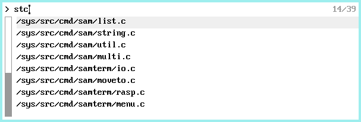

fm
===
fm provides a gui to select an item from a list using a fuzzy matching algorithm.  
When an item is selected, it is sent to the plumber `send` port unless the `-p` option
is used in which case the item name is printed on standard output and the application exits.

Left-click an item to select it.  
Right-click to activate the selected item.

Keyboard shortcuts:
- Arrow up / down change selection
- Enter activate selection
- Page up / down scroll by one screen page
- Home go to first item in the list
- End go to last item in the list
- Ctrl-U clears the input line
- Esc clears the input line unless input is empty in which case it exits fm
- Del to exit fm

Usage:
-------
Install with usual ``mk install``  
Run: ``... | fm [-p]``

The provided `b` script gives a usage example.

Credits:
---------
The fuzzy matching algorithm has been ported from: 
* https://github.com/forrestthewoods/lib_fts/

Bugs:
------
Obviously!
